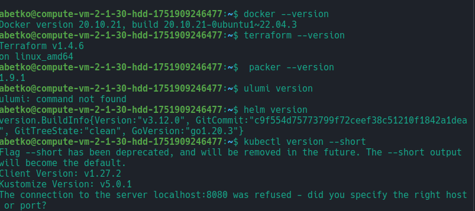
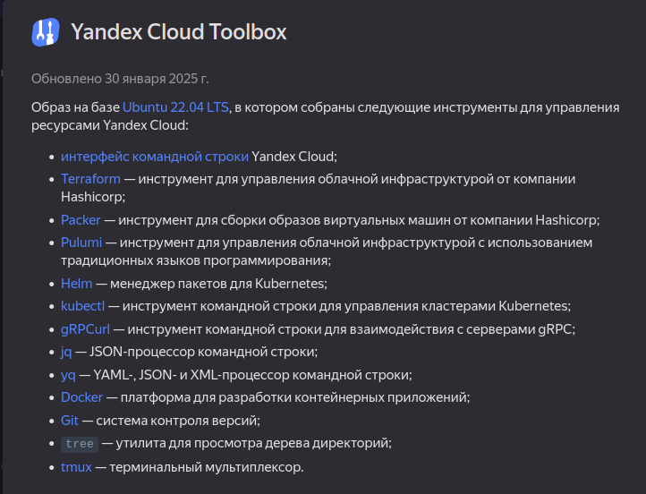
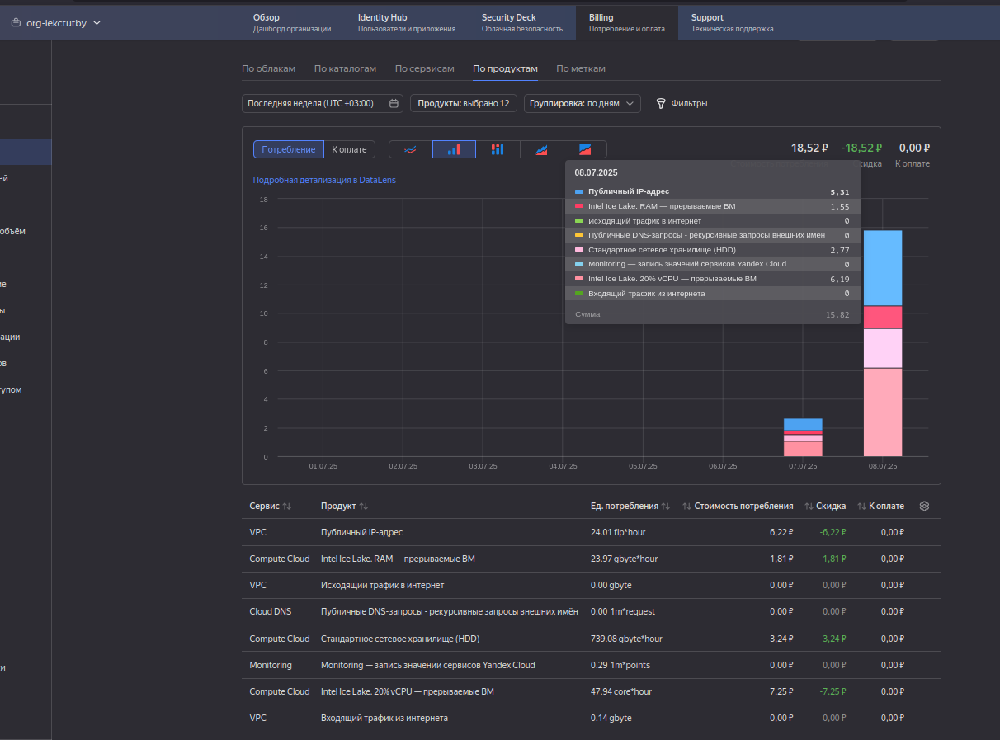

# Домашнее задание к занятию 1.  «Введение в виртуализацию» - Бетко Алексей

## Задача 1

1. Создайте через web-интерфейс Yandex Cloud - VPC и виртуальную машину из инструкции конфигурации "эконом-ВМ" с публичным ip-адресом. В пункте "Выбор образа/загрузочного диска" выберите вкладку "Cloud Marketplace" , щелкните "Посмотреть больше", найдите образ "Yandex Cloud Toolbox".
2. Убедитесь, что вы можете подключиться к консоли ВМ через ssh, используя публичный ip-адрес. Убедитесь, что на ВМ установлен Docker с помощью команды ```docker --version```(команду выполните от имени root пользователя) !
3. Узнайте в инструкции Яндекс, какие еще инструменты предустановлены в данном образе.
4. Оставьте ВМ работать, пока она не выключится самостоятельно! Опция "прерываемая" выключит ее не позже чем через 24 часа. 
5. Для наглядности подождите еще 1 сутки.
6. Перейдите по [ссылке ](https://console.cloud.yandex.ru/billing?section=accounts). Выберите свой платежный аккаунт. Перейдите на вкладку детализация (фильтр "По продуктам") и оцените график потребления финансов.
7. Удалите ВМ или пользуйтесь ею при выполнении последующих домашних заданий курса обучения.

### Ответ






---


## Задача 2

Выберите один из вариантов платформы в зависимости от задачи. Здесь нет однозначно верного ответа так как все зависит от конкретных условий: финансирование, компетенции специалистов, удобство использования, надежность, требования ИБ и законодательства, фазы луны.

Тип платформы:

- физические сервера;
- паравиртуализация;
- виртуализация уровня ОС;

Задачи:
- высоконагруженная база данных MySql, критичная к отказу;
- различные web-приложения;
- Windows-системы для использования бухгалтерским отделом;
- системы, выполняющие высокопроизводительные расчёты на GPU.

### Ответ

- высоконагруженная база данных MySql, критичная к отказу;
подходят "физические сервера", так как для работы MySql требуются в основном cpu и диски, так же на эту высоконагруженную систему ни кто не сможет повлиять

- различные web-приложения;
подходят "паравиртуализация" и "виртуализация уровня ОС", но чаще всего используют "виртуализация уровня ОС", так как подымают приложения в облегченых виртуалках (контейнерах) и потребляют меньше ресурсов чем виртуалки в "паравиртуализация"

- Windows-системы для использования бухгалтерским отделом;
Если требуется подымать удаленный доступ с windows-службами (например тонкий или толстый клиент 1c, почту, офис) то хорошо подходит "паравиртуализация", так как данные виртуальные машины становятся независмые друг от друга и бухгалтера не будут мешать.
Если нужно поднять web-приложения как удаленные приложения, то можно реализовать это на обычном "физическом сервере", так как у бухгалтера будет доступ только в рамках этого приложения.
Если подразумеваются разворачивание службы mssql, 1c и т.п. то походит "паравиртуализация" и "физические сервера", но склоняюсь тут к "физические сервера", так как mssql и 1С лучше работает на железе, чем в виртуалках

- системы, выполняющие высокопроизводительные расчёты на GPU.
подходят "физические сервера", так как проброс оборудования (в нашем случае GPU) в виртуализацию плохо реализован, чем прямой доступ до устройств в ос. А с дефолтными (виртуальными) устройствами GPU мы не сможем выжать всю мощность физического GPU.


## Задача 3

Выберите подходящую систему управления виртуализацией для предложенного сценария. Опишите ваш выбор.

Сценарии:

1. 100 виртуальных машин на базе Linux и Windows, общие задачи, нет особых требований. Преимущественно Windows based-инфраструктура, требуется реализация программных балансировщиков нагрузки, репликации данных и автоматизированного механизма создания резервных копий.
2. Требуется наиболее производительное бесплатное open source-решение для виртуализации небольшой (20-30 серверов) инфраструктуры на базе Linux и Windows виртуальных машин.
3. Необходимо бесплатное, максимально совместимое и производительное решение для виртуализации Windows-инфраструктуры.
4. Необходимо рабочее окружение для тестирования программного продукта на нескольких дистрибутивах Linux.


### Ответ

1. Так как у нас преимущественно Windows based-инфраструктура, то в данном случае подходит "Hyper-V" и "VMWare" подходят более хорошо, но лучше всего использовать "Hyper-V" так как он лучше совместимость с Windows OS
2. В данном случае подойдут Xen, KVM, выбор какая лучше зависит от типа выполняемых операций на  виртуальных машинах
3. в данном случае "Hyper-V" очень хорошо подходит, так как он лучше совместим с windows OS, так же может подойти Xen
4. В данном случае очень хорошо подходит "виртуализация уровня ОС", например как docker, podman, containerd и т.п.

## Задача 4

Опишите возможные проблемы и недостатки гетерогенной среды виртуализации (использования нескольких систем управления виртуализацией одновременно) и что необходимо сделать для минимизации этих рисков и проблем. Если бы у вас был выбор, создавали бы вы гетерогенную среду или нет?

### Ответ

Гетерогенная среда виртуализации, в которой используются разные гипервизоры и платформы, может столкнуться с рядом проблем, включая сложность управления, снижение производительности, проблемы совместимости и высокие затраты на интеграцию. Особенно сложным становится управление данными и обеспечение безопасности при миграции между различными средами.
Основные проблемы и недостатки:
- Сложность управления
- Проблемы совместимости
- Снижение производительности
- Проблемы с миграцией
- Высокие затраты на интеграцию
- Риски безопасности
- Потенциальные проблемы с отказоустойчивостью.

Для минимилизации рисков и проблемлучше всего использовать практики IaC и попробовать привести инфраструктуру к одному типу.

Создание гетерогенной среды зависит от потребностей, иногда имеются службы которые могут быть не совместимы или менее производительные в одной виртуализацией и лучше работаю в другой. Так же проекты могут быть закрытыми и там достаточно будет одной или несколько виртуальных машин в облаке. Так же облачная виртуализация предоставляет вкусные фишки, которыми стоит воспользоваться. 